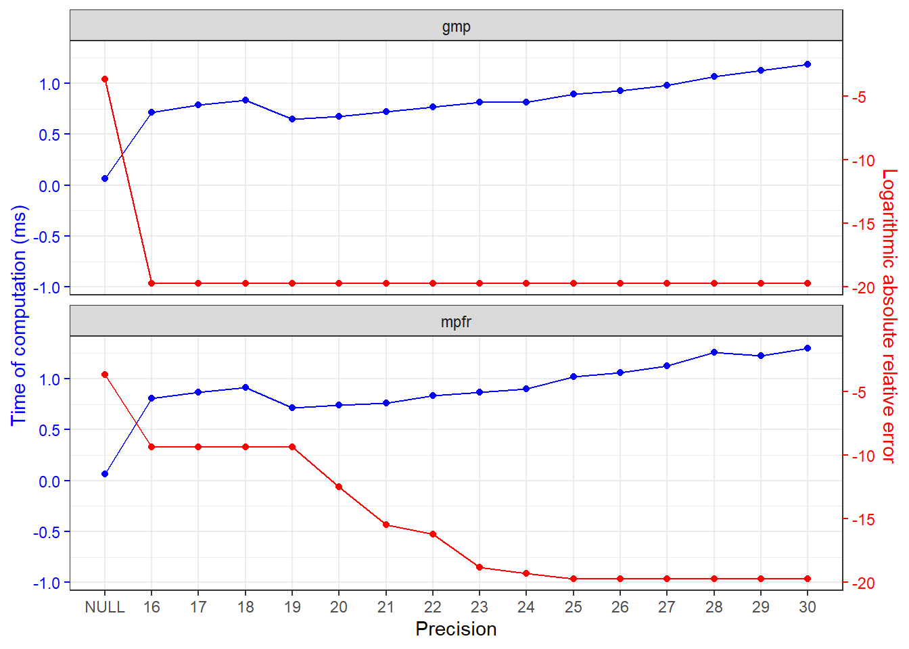

<!-- README.md is generated from README.Rmd. Please edit that file -->

# Generalized hypergeometric function with tunable high precision

<!-- badges: start -->

[](https://lifecycle.r-lib.org/articles/stages.html#experimental)
[](https://CRAN.R-project.org/package=hypergeo2)
[](https://github.com/zhuxr11/hypergeo2/actions/workflows/R-CMD-check.yaml)
[](https://CRAN.R-project.org/package=hypergeo2)
<!-- badges: end -->

**Package**: [*hypergeo2*](https://github.com/zhuxr11/hypergeo2)
0.0.0.9000<br /> **Author**: Xiurui Zhu<br /> **Modified**: 2024-09-17
00:12:09<br /> **Compiled**: 2024-09-17 00:12:15

The goal of `hypergeo2` is to implement generalized hypergeometric
function with tunable high precision. Two floating-point datatypes –
`mpfr_float` and `gmp_float` – are channeled into this package. The
computation is limited to real numbers, since its underlying workhorse
[`boost::math::detail::hypergeometric_pFq_checked_series()`](https://www.boost.org/doc/libs/master/boost/math/special_functions/detail/hypergeometric_pFq_checked_series.hpp)
from [`BH` package](https://cran.r-project.org/package=BH) implements
comparisons (`>` or `<`) between numbers, which are not defined for
complex datatypes.

## Installation

### System requirements

If you are building from source (e.g. not installing binaries on
Windows), you need to prepare for two system requirements:
[GMP](https://gmplib.org/) and [MPFR](https://www.mpfr.org/), to
facilitate high-precision floating point types. You may follow the
installation instructions from their websites, or try the following
commands for quick (default) installation.

- For Windows with rtools40 (or newer) installed, please run:

``` bash
pacman -Syu make pkg-config libtool gmp mpfr
```

- For macOS, please run:

``` bash
brew install gmp mpfr
```

- For linux, please build and install platform-specific libraries
  through their `configure` file, or install them using `conda`.

If you are running R from an isolated environment (e.g. `conda`), you
need to first activate the environment, and then build the system
requirements and the package in the same environment to avoid version
conflicts such as: undefined reference to `memcpy@GLIBC#.#.#`.

### The package

If the requirements are installed into their default paths (e.g. without
using the `--prefix` option), you are OK to go ahead installing the
package in R, as `pkg-config` will take care finding them.

You can install the released version of `hypergeo2` from
[CRAN](https://cran.r-project.org/) with:

``` r
install.packages("hypergeo2")
```

Alternatively, you can install the developmental version of `hypergeo2`
from [github](https://github.com/) with:

``` r
remotes::install_github("zhuxr11/hypergeo2")
```

However, if the requirements are not installed into their default paths,
you may first need to provide configuration arguments/variables to
installation paths. Optionally, you may also designate the [maximal
series
iteration](https://www.boost.org/doc/libs/master/libs/math/doc/html/math_toolkit/pol_ref/iteration_pol.html),
default at 10000. To sum up, you may configure the installation in one
of the following ways (replacing `<my_gmp_install>`, `<my_mpfr_install>`
and `<my_max_iter>` with your paths) before installing the package with
`R CMD INSTALL` in bash:

- Set `--configure-args` in `R CMD INSTALL`:

``` bash
MY_GMP_INSTALL='<my_gmp_install>'
MY_MPFR_INSTALL='<my_mpfr_install>'
MY_MAX_ITER=<my_max_iter>
R CMD INSTALL hypergeo2 \
  --configure-args="\
    --with-gmp-include=${MY_GMP_INSTALL}/include \
    --with-mpfr-include=${MY_MPFR_INSTALL}/include \
    --with-gmp-lib=${MY_GMP_INSTALL}/lib \
    --with-mpfr-lib=${MY_MPFR_INSTALL}/lib \
    --with-max-iter=${MY_MAX_ITER}\
  "
```

- Set `--configure-vars` in `R CMD INSTALL`:

``` bash
MY_GMP_INSTALL='<my_gmp_install>'
MY_MPFR_INSTALL='<my_mpfr_install>'
MY_MAX_ITER=<my_max_iter>
R CMD INSTALL hypergeo2 \
  --configure-vars="\
    GMP_INCLUDE=${MY_GMP_INSTALL}/include \
    MPFR_INCLUDE=${MY_MPFR_INSTALL}/include \
    GMP_LIB=${MY_GMP_INSTALL}/lib \
    MPFR_LIB=${MY_MPFR_INSTALL}/lib \
    MAX_ITER=${MY_MAX_ITER}\
  "
```

## Examples of generalized hypergeometric function with tunable high precision

Sometimes, computing generalized hypergeometric function in double
precision is not sufficient, even though we only need 6-8 accurate
digits in the results. Here, two floating-point datatypes are provided:
`mpfr_float` (“mpfr”) and `gmp_float` (“gmp”). By comparison, the “mpfr”
backend is safer, since it defines while the “gmp” backend throws
overflow exception. Therefore, `mpfr_float` is used as the default
backend.

``` r
library(hypergeo2)
```

For example, let us compute a generalized hypergeometric function in
[Matlab Online](https://matlab.mathworks.com/) and use its value as
reference:

    >> fprintf("%.32g", hypergeom([-28.2 11.8 15.8], [12.8 17.8], 1))
    2.7120446907792120783054486094854e-09

First, we compute the same function with `hypergeo::genhypergeo()`
function.

``` r
hypergeo_U <- c(-28.2, 11.8, 15.8)
hypergeo_L <- c(12.8, 17.8)
hypergeo_z <- 1
(hypergeo_res <- hypergeo::genhypergeo(U = hypergeo_U, L = hypergeo_L, z = hypergeo_z))
#> [1] 3.419707e-09
```

As can be seen, the result is heavily deviated by 0.261 in terms of
relative error.

Then, we compute the same function with `hypergeo2::genhypergeo()`
function, at default (double) precision.

``` r
(hypergeo2_res_double <- genhypergeo(U = hypergeo_U, L = hypergeo_L, z = hypergeo_z))
#> [1] 2.781375e-09
```

As can be seen, the result is still deviated by 0.0256 in terms of
relative error, although much better.

Next, we compute the same function with `hypergeo2::genhypergeo()`
function, with a precision of 20 digits from `mpfr` and `gmp` backends,
respectively.

``` r
(hypergeo2_res_prec20_mpfr <- genhypergeo(U = hypergeo_U, L = hypergeo_L, z = hypergeo_z,
                                          prec = 20L, backend = "mpfr"))
#> [1] 2.712035e-09
(hypergeo2_res_prec20_gmp <- genhypergeo(U = hypergeo_U, L = hypergeo_L, z = hypergeo_z,
                                         prec = 20L, backend = "gmp"))
#> [1] 2.712045e-09
```

As can be seen, the result from `gmp` backend is more precise than that
from `mpfr`, with the deviation of `mpfr` at -3.75e-06 and that of `gmp`
at 2.68e-09. This is because that `gmp` usually use higher precision
than we set (see [this
post](https://www.mpfr.org/faq.html#:~:text=What%20are%20the%20differences%20between%20MPF%20from%20GMP,minimum%20value%20%28MPF%20generally%20uses%20a%20higher%20precision%29)).

Finally, to validate this hypothesis, we further increase the precision
to 25 digits.

``` r
(hypergeo2_res_prec25_mpfr <- genhypergeo(U = hypergeo_U, L = hypergeo_L, z = hypergeo_z,
                                          prec = 25L, backend = "mpfr"))
#> [1] 2.712045e-09
(hypergeo2_res_prec25_gmp <- genhypergeo(U = hypergeo_U, L = hypergeo_L, z = hypergeo_z,
                                         prec = 25L, backend = "gmp"))
#> [1] 2.712045e-09
```

As can be seen, now both results are very close to the reference, with
deviations from `mpfr` and `gmp` backends at 2.72e-09 and 2.68e-09,
respectively.

## Precision vs time of computation

The time of computation at different precision is profiled in this
section.

``` r
bench_scheme <- expand.grid(prec = c(list(NULL), as.list(seq(16L, 30L))),
                            backend = c("mpfr", "gmp"),
                            stringsAsFactors = FALSE)
bench_fun <- function(prec, backend, quote = FALSE) {
  res <- bquote(genhypergeo(U = hypergeo_U, L = hypergeo_L, z = hypergeo_z,
                            prec = .(prec), backend = .(backend)) / ref_value - 1)
  if (quote == FALSE) {
    eval(res)
  } else {
    res
  }
}
bench_scheme[["err"]] <- mapply(
  FUN = bench_fun,
  prec = bench_scheme[["prec"]],
  backend = bench_scheme[["backend"]],
  USE.NAMES = FALSE,
  SIMPLIFY = TRUE
)
bench_res <- summary(microbenchmark::microbenchmark(
  list = mapply(
    FUN = bench_fun,
    prec = bench_scheme[["prec"]],
    backend = bench_scheme[["backend"]],
    MoreArgs = list(quote = TRUE),
    USE.NAMES = FALSE,
    SIMPLIFY = TRUE
  ),
  times = 100L
))
bench_res <- cbind(bench_scheme, bench_res[colnames(bench_res) %in% "expr" == FALSE])
bench_res[["prec"]] <- as.character(bench_res[["prec"]])
ggplot2::ggplot(
  bench_res,
  ggplot2::aes(x = as.integer(factor(prec, levels = unique(prec))))
) +
  ggplot2::geom_point(ggplot2::aes(y = mean / 1000), color = "blue") +
  ggplot2::geom_line(ggplot2::aes(y = mean / 1000), color = "blue") +
  ggplot2::geom_point(ggplot2::aes(y = (log(abs(err)) + 12) / 8), color = "red") +
  ggplot2::geom_line(ggplot2::aes(y = (log(abs(err)) + 12) / 8), color = "red") +
  ggplot2::scale_x_continuous(breaks = seq_along(unique(bench_res[["prec"]])),
                              minor_breaks = NULL,
                              labels = unique(bench_res[["prec"]])) +
  ggplot2::scale_y_continuous(
    sec.axis = ggplot2::sec_axis(~. * 8 - 12,
                                 name = "Logarithmic absolute relative error")
  ) +
  ggplot2::facet_wrap(ggplot2::vars(backend), ncol = 1L) +
  ggplot2::theme_bw() +
  ggplot2::theme(
    axis.title.y.left = ggplot2::element_text(color = "blue"),
    axis.text.y.left = ggplot2::element_text(color = "blue"),
    axis.ticks.y.left = ggplot2::element_line(color = "blue"),
    axis.title.y.right = ggplot2::element_text(color = "red"),
    axis.text.y.right = ggplot2::element_text(color = "red"),
    axis.ticks.y.right = ggplot2::element_line(color = "red")
  ) +
  ggplot2::labs(x = "Precision", y = "Time of computation (ms)")
```


